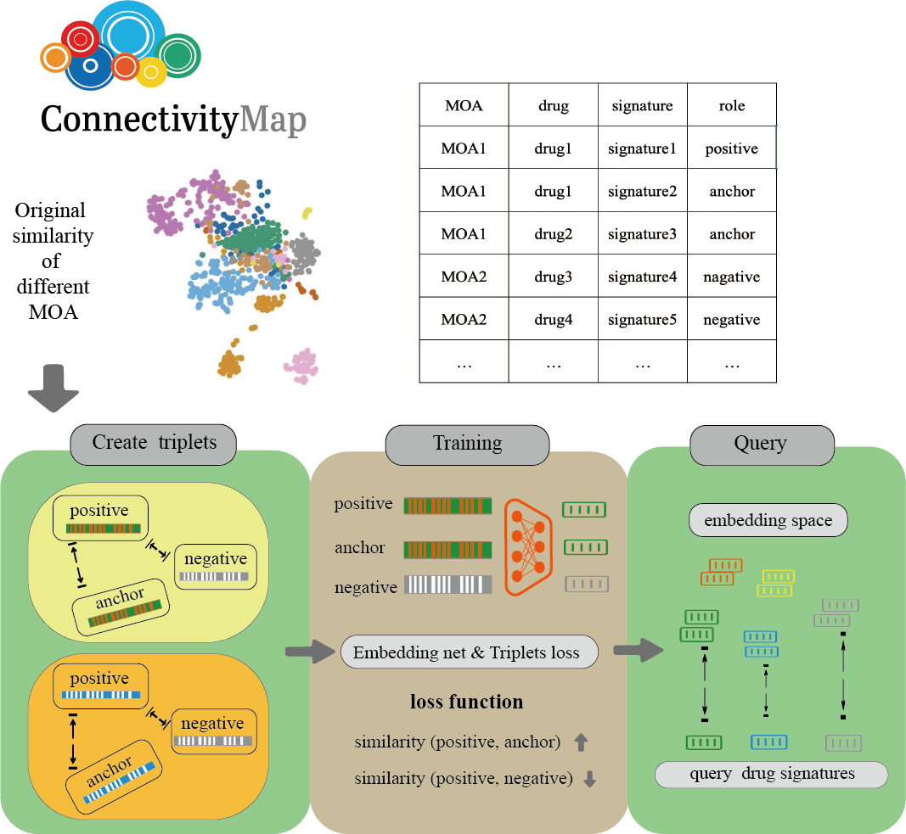

## MOAEMB
Predicting mechanism of action from transcrip-tional signatures with similarity learning


##  Dependencies package:
```
* sklearn
* numpy
* pandas 
* scipy
* pytorch-metric-learning
* h5py
* faiss-gpu
```

#### Install from github   

    git clone https://github.com/jianglikun/MOAEMB.git

## Usage 
we introduce MOAEMB (MOAs prediction via embedding extraction), a method that leverage embedding net and contrastive learning trans-form the signatures with same MOAs into similarity d-dimensional vector of latent feature. In signature embedding space same MOAs are close together and the different are far apart. We evaluate the accura-cy of signature matching with MOAEMB on different TAS data as well as individual cell lines. After compared with several statistical and machine learning techniques, find MOAEMB has a substantial im-provement. 
<p align="center"></p>

#### * **(i)** prepare data
Download the L1000 dataset form [CLUE](https://clue.io/data/CMap2020#LINCS2020);

Use [cmapPy](https://github.com/cmap/cmapPy) process the L1000 data before you gernerating the dataset by youself;

Or you can directly use my processed data, download from https://pan.baidu.com/s/1syd05gFX7x4_STb3eVi13w (verify code 2023);

```
# prepare single signature data
python data/prepare_data_level5.py

# prepare TAS-high data
python data/prepare_data_tas_high.py

# prepare TAS-all data and signle cell data
python data/prepare_data_tas_all.py
```

#### **(ii)** train and test
```
python src/train.py
```

#### **(iii)** compare methods 
```
# all compare method script in ./compare

Benchmark.py

CMapGSEA.py

CMapKS.py

Drsim.py

Euclidean.py

RF.py

Random.py

SVM.py

Spearman.py

jaccard.py
```
##### **(iiii)** downstream analysis
* ##### Figure 2
```
```
* ##### Figure 3
```
```
* ##### Figure 4
```
```
* ##### Figure 5
```
```

## Citation
Predicting mechanism of action from transcrip-tional signatures with similarity learning
submit in 2023


## concat
Likun Jiang jianglikun@stu.xmu.edu.cn

Xiangrong Liu xrliu@xmu.edu.cn

Xiamen University,Xiamen,China

